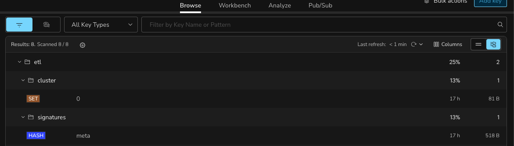

# 🌀 DQ Swirl

Agentic Data Quality & Querying

## Developer Quickstart

Add a `secrets.env` file with the following contents at the root of the repo
```dotenv
LLM_BASE_URL="https://openrouter.ai/api/v1"
LLM_API_KEY=<Your API KEY>
```

Create virtual environment and install dependencies
```bash
uv venv
source .venv/bin/activate

uv tool install maturin
uv sync --all-groups --extra app --extra worker && maturin develop --release
```

Start the services
```
docker compose up
```

## Demo

After following the Developer Quickstart `docker compose up`, start the dummy customer api.

```bash
python app/dummy_customer_api.py
```

Navigate to [http://localhost:3000](http://localhost:3000) and ask your queries there!


**NOTE**: The very first query will likely take about 2.5min to complete, but subsequent queries (doesn't have to be the same) should be in seconds. The assumption is that the underlying structure is the same. Once the structure changes, the system will try and adapt.

**NOTE**: If you would like a hard schema reset, you can open redis insights [http://localhost:5540](http://localhost:5540) and delete the keys within the prefix `etl:`




## Run Test Suite
While you have docker compose running in one terminal, in another run the following:
```bash
pytest -v -s tests/
```

## System Architecture


## Helpful Web Apps
* RedisInsight: [http://localhost:5540](http://localhost:5540)
* PgAdmin4: [http://localhost:9090](http://localhost:9090)
* RustFS: [http://localhost:9001](http://localhost:9001)
* SAQ Task Queue: [http://localhost:8080](http://localhost:8080)

